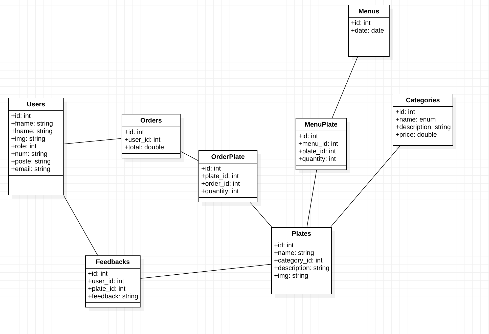
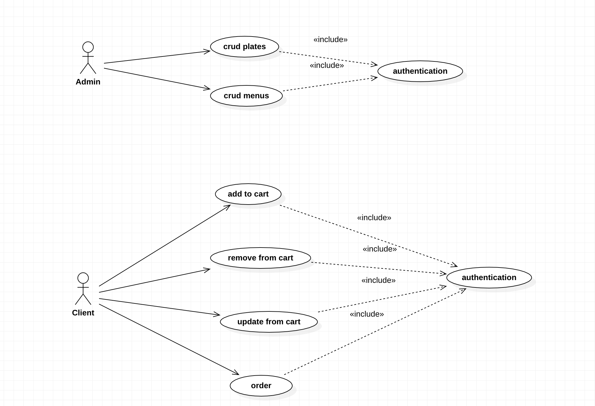

# Labelcious backend

You can find here the diagramm class and the use case of this project with the api description

## Conception






## API Reference

#### Get all categories

```http
  GET /api/categories
```

| Parameter | Type     | Description                |
| :-------- | :------- | :------------------------- |
| `id` | `int` | **Required**. id of category |
| `name` | `string` | **Required**. name of category |
| `description` | `string` | **Required**. description of category |
| `price` | `double` | **Required**. price of the plates that belongs to a category |
| `plates` | `Plate[]` | **Required**. plates that belongs to a category |

#### Get category

```http
  GET /api/categories/${id}
```

| Parameter | Type     | Description                       |
| :-------- | :------- | :-------------------------------- |
| `id`      | `int` | **Required**. Id of category to fetch |

#### Post category

```http
  POST /api/categories
```

| Parameter | Type     | Description                       |
| :-------- | :------- | :-------------------------------- |
| `name` | `string` | **Required**. name of category |
| `description` | `string` | **Required**. description of category |
| `price` | `double` | **Required**. price of the plates that belongs to a category |

#### Update category

```http
  PUT /api/categories/${id}
```

| Parameter | Type     | Description                       |
| :-------- | :------- | :-------------------------------- |
| `id`      | `int` | **Required**. Id of category to fetch |
| `name` | `string` | **Required**. name of category |
| `description` | `string` | **Required**. description of category |
| `price` | `double` | **Required**. price of the plates that belongs to a category |


#### Delete category

```http
  DELETE /api/categories/${id}
```

| Parameter | Type     | Description                       |
| :-------- | :------- | :-------------------------------- |
| `id`      | `int` | **Required**. Id of category to delete |


#### Get all feedbacks

```http
  GET /api/feedbacks
```

| Parameter | Type     | Description                |
| :-------- | :------- | :------------------------- |
| `id` | `int` | **Required**. id of feedback |
| `message` | `string` | **Required**. message of feedback |
| `user_id` | `int` | **Required**. user id of the person who's gonna give a feedback |
| `plate_id` | `int` | **Required**. id of the plate |
| `user` | `User` | user who gave the feedback |

#### Get feedback

```http
  GET /api/feedbacks/${id}
```

| Parameter | Type     | Description                |
| :-------- | :------- | :------------------------- |
| `id` | `int` | **Required**. id of feedback |


#### Post feedback

```http
  POST /api/feedbacks
```

| Parameter | Type     | Description                |
| :-------- | :------- | :------------------------- |
| `message` | `string` | **Required**. message of feedback |
| `user_id` | `int` | **Required**. user id of the person who's gonna give a feedback |
| `plate_id` | `int` | **Required**. id of the plate |


#### Update feedback

```http
  PUT /api/feedbacks/${id}
```

| Parameter | Type     | Description                |
| :-------- | :------- | :------------------------- |
| `id` | `int` | **Required**. id of feedback |
| `message` | `string` | **Required**. message of feedback |
| `user_id` | `int` | **Required**. user id of the person who's gonna give a feedback |
| `plate_id` | `int` | **Required**. id of the plate |

#### Delete feedback

```http
  DELETE /api/feedbacks/${id}
```

| Parameter | Type     | Description                |
| :-------- | :------- | :------------------------- |
| `id` | `int` | **Required**. id of feedback |


#### Get all plates

```http
  GET /api/plates
```

| Parameter | Type     | Description                |
| :-------- | :------- | :------------------------- |
| `id` | `int` | **Required**. id of plate |
| `name` | `string` | **Required**. name of plate |
| `description` | `string` | **Required**. description of the plate |
| `image` | `string` | **Required**. image of the plate |
| `category_id` | `int` | **Required**. id of category that contains this plate |
| `category` | `Category` | **Required**. category that contains this plate |
| `feedbacks` | `Feedback[]` | **Required**. list of feedbacks on this plate |

#### Get plate

```http
  GET /api/plates/${id}
```

| Parameter | Type     | Description                |
| :-------- | :------- | :------------------------- |
| `id` | `int` | **Required**. id of plate |


#### Post plate

```http
  POST /api/plates
```

| Parameter | Type     | Description                |
| :-------- | :------- | :------------------------- |
| `name` | `string` | **Required**. name of plate |
| `description` | `string` | **Required**. description of the plate |
| `image` | `string` | **Required**. image of the plate |
| `category_id` | `int` | **Required**. id of category that contains this plate |

#### Update plate

```http
  PUT /api/plates/${id}
```

| Parameter | Type     | Description                |
| :-------- | :------- | :------------------------- |
| `id` | `int` | **Required**. id of plate |
| `name` | `string` | **Required**. name of plate |
| `description` | `string` | **Required**. description of the plate |
| `image` | `string` | **Required**. image of the plate |
| `category_id` | `int` | **Required**. id of category that contains this plate |

#### Delete plate

```http
  DELETE /api/plates/${id}
```

| Parameter | Type     | Description                |
| :-------- | :------- | :------------------------- |
| `id` | `int` | **Required**. id of plate to delete |


#### Get all menus

```http
  GET /api/menuPlates
```

| Parameter | Type     | Description                |
| :-------- | :------- | :------------------------- |
| `id` | `int` | **Required**. id of menu |
| `date` | `date` | **Required**. date of menu |
| `plates` | `Plate[]` | **Required**. plates that belongs to this menu |

#### Get menu

```http
  GET /api/menuPlates/${id}
```

| Parameter | Type     | Description                |
| :-------- | :------- | :------------------------- |
| `id` | `int` | **Required**. id of menu |

#### Get menu by date

```http
  GET /api/menuPlates/${date}
```

| Parameter | Type     | Description                |
| :-------- | :------- | :------------------------- |
| `date` | `string` | **Required**. date of menu |

#### Post menu

```http
  POST /api/menuPlates
```

| Parameter | Type     | Description                |
| :-------- | :------- | :------------------------- |
| `date` | `date` | **Required**. date of menu |
| `plates` | `Plate[]` | **Required**. plates that belongs to this menu |

#### Update menu

```http
  PUT /api/menuPlates/${id}
```

| Parameter | Type     | Description                |
| :-------- | :------- | :------------------------- |
| `id` | `int` | **Required**. id of menu |
| `date` | `date` | **Required**. date of menu |
| `plates` | `Plate[]` | **Required**. plates that belongs to this menu |

#### Delete menu

```http
  DELETE /api/menuPlates/${id}
```

| Parameter | Type     | Description                |
| :-------- | :------- | :------------------------- |
| `id` | `int` | **Required**. id of menu |


#### Get all users

```http
  GET /api/users
```

| Parameter | Type     | Description                |
| :-------- | :------- | :------------------------- |
| `id` | `int` | **Required**. id of user |
| `firstName` | `string` | **Required**. first name of user |
| `lastName` | `string` | **Required**. last name of user |
| `email` | `string` | **Required**. email of user |
| `job` | `string` | **Required**. job of user |
| `number` | `string` | **Required**. number of badge of the user |
| `image` | `string` | **Required**. image of the user |
| `role` | `int` | **Required**. role of the user (admin or client) 0 for admins and 1 for clients |


#### Get user

```http
  GET /api/users/${id}
```

| Parameter | Type     | Description                |
| :-------- | :------- | :------------------------- |
| `id` | `int` | **Required**. id of user |


#### Post user

```http
  POST /api/users
```

| Parameter | Type     | Description                |
| :-------- | :------- | :------------------------- |
| `firstName` | `string` | **Required**. first name of user |
| `lastName` | `string` | **Required**. last name of user |
| `email` | `string` | **Required**. email of user |
| `job` | `string` |  job of user |
| `number` | `string` |  number of badge of the user |
| `image` | `string` |  image of the user |
| `role` | `int` | **Required**. role of the user (admin or client) 0 for admins and 1 for clients |

#### Update user

```http
  POST /api/users/${id}
```

| Parameter | Type     | Description                |
| :-------- | :------- | :------------------------- |
| `id` | `int` | **Required**. id of user |
| `firstName` | `string` | **Required**. first name of user |
| `lastName` | `string` | **Required**. last name of user |
| `email` | `string` | **Required**. email of user |
| `job` | `string` |  job of user |
| `number` | `string` |  number of badge of the user |
| `image` | `string` |  image of the user |
| `role` | `int` | **Required**. role of the user (admin or client) 0 for admins and 1 for clients |


#### Delete user

```http
  DELETE /api/users/${id}
```

| Parameter | Type     | Description                |
| :-------- | :------- | :------------------------- |
| `id` | `int` | **Required**. id of user |